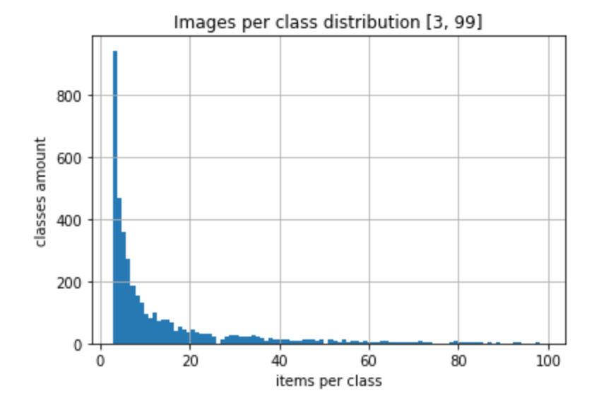
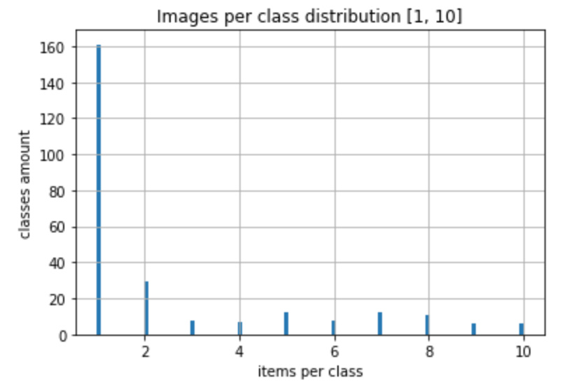
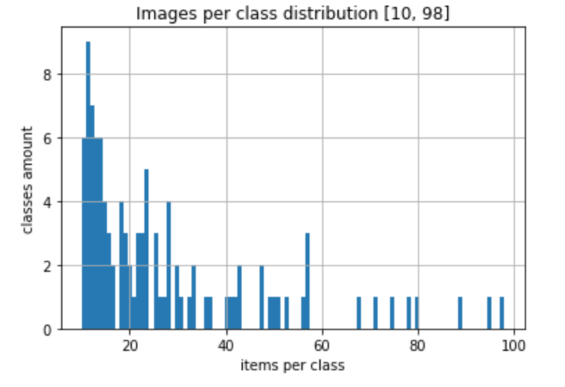
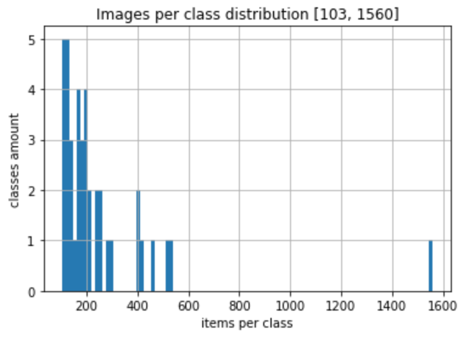

# Datasets used for Coin Vision Machine Learning experiments

* Micro - 25 classes [Download](https://s3.amazonaws.com/coin-vision/micro-25-20190204.csv)

* Mini - 400 classes [Download](https://s3.amazonaws.com/coin-vision/mini-400-20190205.csv)
   
* Medium - 4,000 classes [Download](https://s3.amazonaws.com/coin-vision/medium-4000-20190205.csv)

* Complete - 24,000 classes [Download](https://s3.amazonaws.com/coin-vision/complete-24000-20190205.csv)

* USA coins - 398 classes [Download](https://s3.amazonaws.com/coin-vision/usa-coins-398-classes.csv)

#### Micro

Micro dataset has 25 classes with 50-60 images for each class


#### Mini

Micro dataset has 400 classes with 30-100 images for each class


#### Medium

Medium dataset has 4,000 classes with 3-100 images for each class




#### Complete

Complete dataset has 23,695 classes with 1-1000+ images for each class

A lot of classes (16K+) have one image per class only.
About 100 classes have 100+ images per class.


#### USA coins

The dataset has 398 classes with 1-1000+ images for each class

160 classes have one image per class only.
About 100 classes have in between 10 and 100 images per class.
40 classes have 100+ images per class. One class has 1600 images.






[dataset-info.ipynb](https://github.com/coin-vision/datasets/blob/master/dataset-info.ipynb) can be used for more detailed dataset evaluation.

Dependencies used in Jupyter Notebook
```
  pip install --upgrade pip
  pip install pandas matplotlib jupyter

```