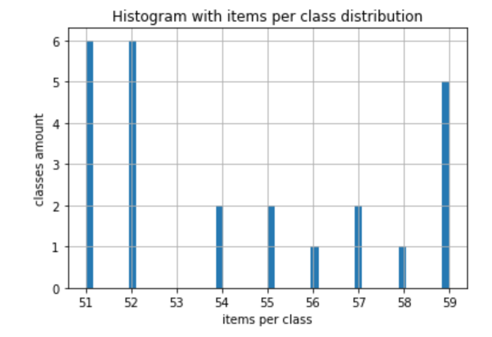
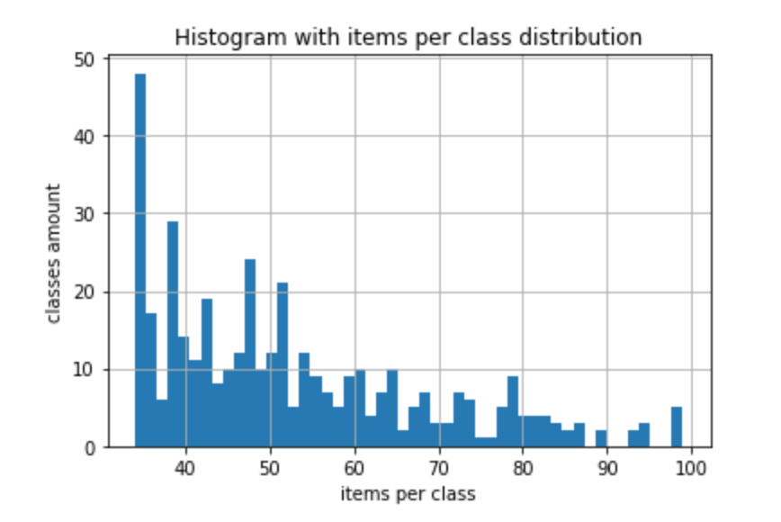
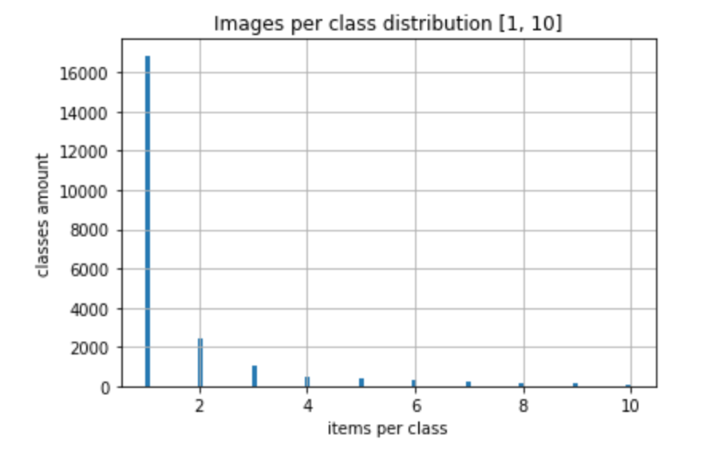
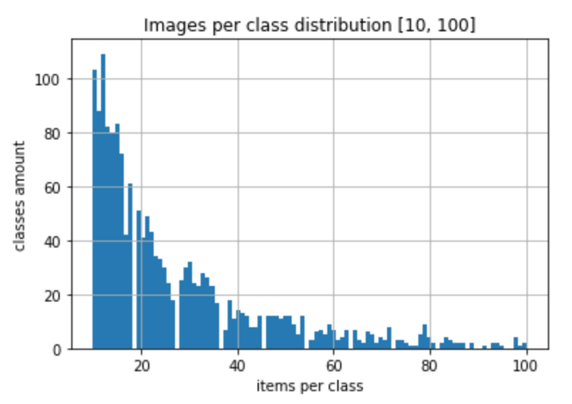
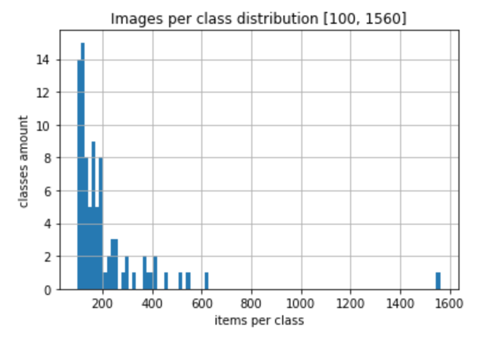

# Datasets used for Coin Vision Machine Learning experiments

* Micro - 25 classes [Download](https://s3.amazonaws.com/coin-vision/micro-25-20190204.csv)

* Mini - 400 classes [Download](https://s3.amazonaws.com/coin-vision/mini-400-20190205.csv)
   
* Medium - 4,000 classes [Download](https://s3.amazonaws.com/coin-vision/medium-4000-20190205.csv)

* Complete - 24,000 classes [Download](https://s3.amazonaws.com/coin-vision/complete-24000-20190205.csv)

#### Micro

Micro dataset has 25 classes with 50-60 images for each class



[Download Micro dataset](https://s3.amazonaws.com/coin-vision/micro-25-20190204.csv)


#### Mini

Micro dataset has 400 classes with 30-100 images for each class




[Download Mini dataset](https://s3.amazonaws.com/coin-vision/mini-400-20190205.csv)


#### Medium

Medium dataset has 4,000 classes with 3-100 images for each class


[Download Medium dataset](https://s3.amazonaws.com/coin-vision/medium-4000-20190205.csv)


#### Complete

Complete dataset has 23,695 classes with 1-1000+ images for each class

A lot of classes (16K+) have one image per class only.
About 100 classes have 100+ images per class.





[Download Complete dataset](https://s3.amazonaws.com/coin-vision/complete-24000-20190205.csv)


Dependencies used in Jupyter Notebook
```
  pip install --upgrade pip
  pip install pandas matplotlib jupyter

```